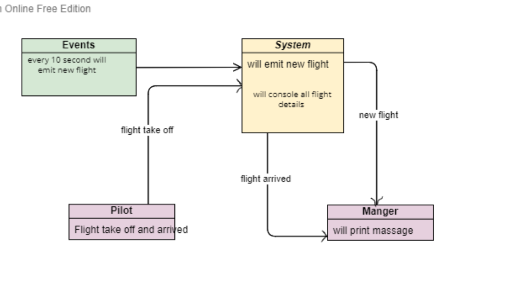

# airline-system2
## Introduction 
* Socket.IO
is a JavaScript library for real-time web applications. It enables real-time, bi-directional communication between web clients and servers. It has two parts − a client-side library that runs in the browser, and a server-side library for node.js. Both components have an identical API
* Real-time Applications
* Instant messengers

* Push Notifications

* Collaboration Applications

* Online Gaming

### we have to prepare express server using npm , and we have to install socket io
 * we can Installe socket io  and socket io - client , using npm 


### What I did in this lap 

* first I created new repo so will be no conflet or miss arrange for the last lap , events lap 
* the same as last lap we have 3 parts System , Pilot , and Manger 
* I made 3 different system for each one , and I installed separete packages for each one , but system I installed the socket io , and for the others I installed socket io - client 
* I prepared in the system one more file , this file will emit the new flight event using socket io connection with the fake information for the flights , every 10 second 
````
Flight {
  event: 'new-flight',
  time: '2023-05-31T09:49:14.213Z',
  Details: {
    airLine: 'Al ETIHAD',
    flightID: 'ac339755-dbf4-4385-b894-04e21b7675ec',
    pilot: 'Jerad Goldner',
    destination: 'Mauritania',
    status: '🐚'
  }
`````
* The system file wil keep the socket connection on every time recive from event , will conole log the result 
* The maneger will be notified each time so he will console log a massage , new flight schedualed 
* We have name space connection between the system and the pilot , so the pilot will be notified when there new flight , and will notify the system for take off and arrived flight , also he will console log massage when flight take off or arrived 
`````
Flight {
  event: 'took-off',
  time: '2023-04-01T16:29:06.003Z',
  Details: {
    airLine: 'Al ETIHAD',
    flightID: '8057a36d-8409-4b57-8b88-142ed946dc57',
    pilot: 'Meghan Runolfsson',
    destination: 'Tuvalu',
    status: '🦍'
  }
}
Flight {
  event: 'arrived',
  time: '2023-04-01T16:29:06.003Z',
  Details: {
    airLine: 'Al ETIHAD',
    flightID: '8057a36d-8409-4b57-8b88-142ed946dc57',
    pilot: 'Meghan Runolfsson',
    destination: 'Tuvalu',
    status: '🦍'
  }

`````
* then the manger should be notified when there a flight arrived , so he will console a massage for the pilot name 

* lets start with simple UML diagram then we will see all the result :

 

 * now we need to start each system separtly , so we can see the connection as shown below : 

 .png)

* after 10 second I will start gitting result as shown 
this the result in single page 

.png)

* this is my manger page shows :

.png)

* and this is the result for pilot Page 
in single page 

.png)

* All the result together as shown :

.png)


